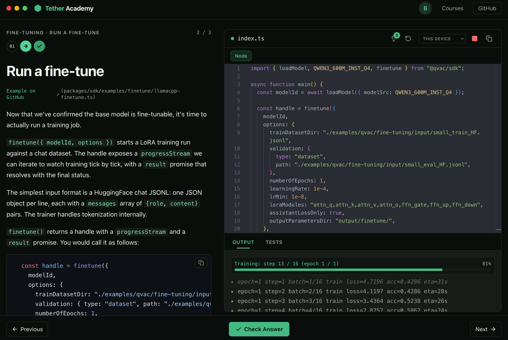

# Tether Academy (web)

Interactive code school for the [Tether](https://tether.io) product suite. Next.js 15 + Fumadocs, static export to `out/`.

[](https://youtu.be/m3e4nDuLERo)

## Getting started

### Prerequisites

- Node.js 20.18+ (Node 20 LTS and Node 22 are supported)
- pnpm 9.15.9 (matches the workspace `packageManager` field)

### Setup

```bash
pnpm install
```

### Development

```bash
pnpm dev          # Turbopack dev with HMR (recommended)
pnpm dev:webpack  # webpack dev, fallback if Turbopack misbehaves
pnpm dev:clean    # wipe .next/.source/.turbo then start Turbopack
```

The dev server runs on http://localhost:3000 by default.

### Build (static export)

```bash
pnpm build        # full pipeline: prebuild (sync + verify) + next build. Use for deploy.
```

Output goes to `apps/web/out/`. The site is fully static; drop the directory on any static host.

For a local visual check without the sync and verify steps, use the package-local command from `apps/web/`:

```bash
pnpm build:dev
```

### Serve the static export

```bash
pnpm start        # node serve.mjs on port 3000
```
